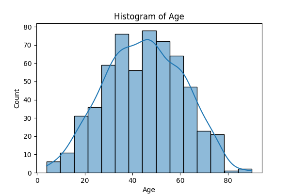
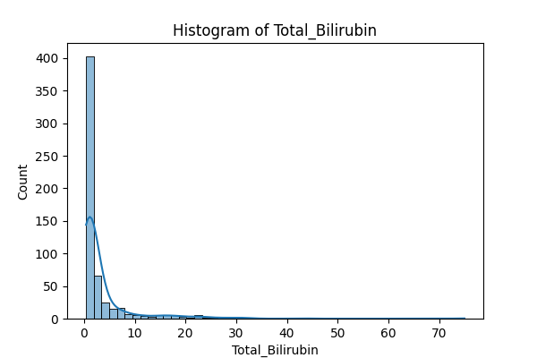
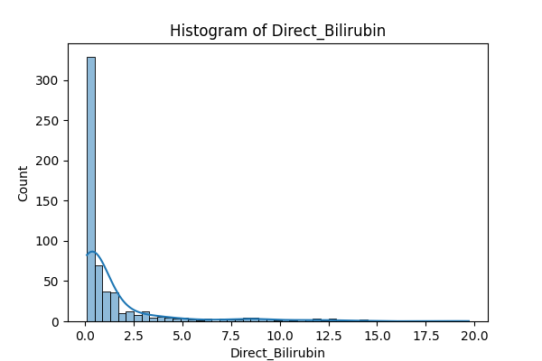
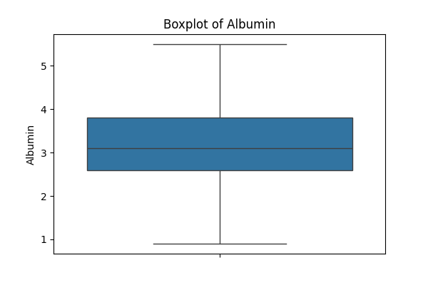
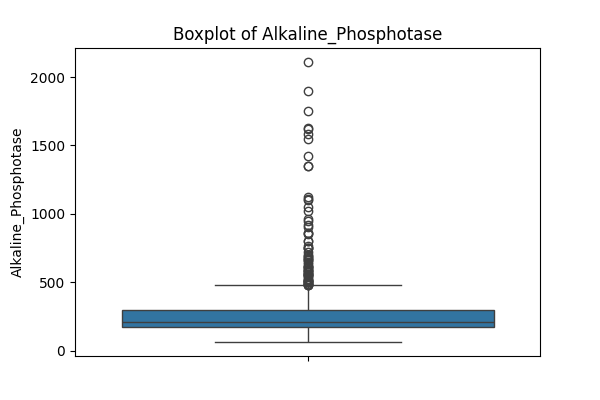
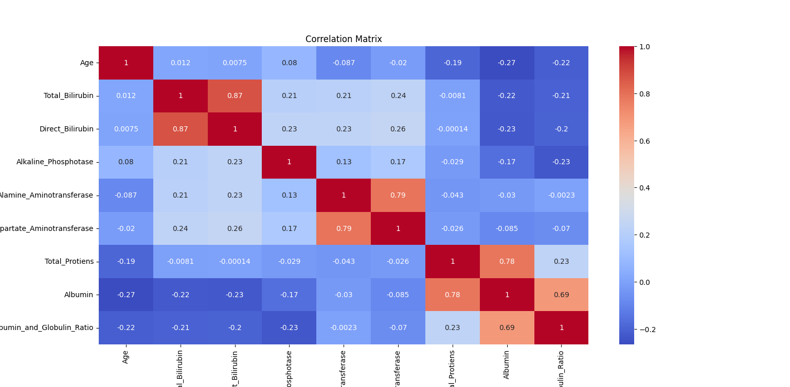
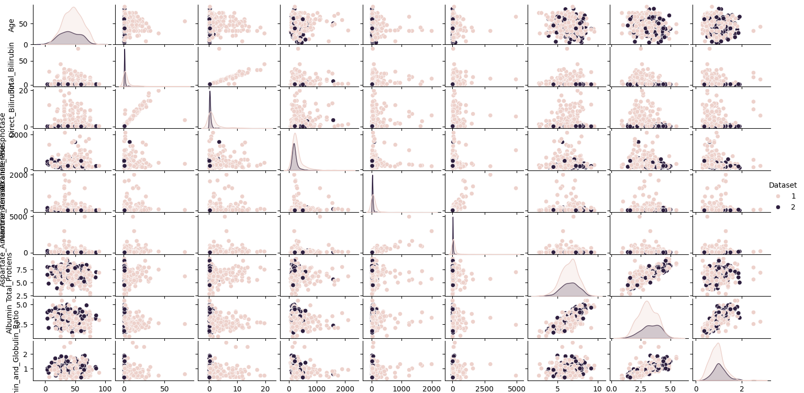

# EDA on Indian Liver Patient Dataset

## Dataset Used
- **Name**: Indian Liver Patient Dataset
- **Source**: [Kaggle](https://www.kaggle.com/code/netzone/indian-liver-disease-modeling)
- **Original Dataset**: `indian_liver_patient.csv`
- **Cleaned Dataset**: `cleaned_ilpd.csv`
- **Description**: Medical data for liver patients including blood test results and diagnostic labels (1 = liver disease, 2 = no liver disease).

## Task Objective
To perform Exploratory Data Analysis (EDA) using:
- Summary statistics (mean, median, std)
- Histograms and boxplots for numeric features
- Correlation matrix and pairplot
- Detect trends, patterns, or anomalies
- Make feature-level inferences from visuals
- Apply basic feature engineering

## Steps Performed
1. Missing values in `Albumin_and_Globulin_Ratio` were filled using the median.
2. `Gender` was converted from text to numeric: `Male = 1`, `Female = 0`.
3. Two new age-based features were added:
  - `Is_Child` → 1 if `Age < 18`, else 0
  - `Is_Senior` → 1 if `Age > 60`, else 0
4. Plotted:
   - Histograms
   - Boxplots
   - Correlation heatmap
   - Pairplot
5. Cleaned dataset saved as `cleaned_ilpd.csv`

## Visualizations & Insights

### Histogram: Age Distribution
- Most patients are between **30–60 years old**.
- Few patients are children (<18) or seniors (>60).

---

### Histogram: Total Bilirubin
- Right-skewed distribution.
- Most patients have low levels, but **some extreme cases exist**, indicating potential liver issues.

---

### Histogram: Direct Bilirubin
- Similar pattern to total bilirubin.
- Highly skewed, suggesting a few patients have abnormally high values.

---

### Boxplot: Albumin
- Slight presence of **outliers** on the lower end.
- Could indicate protein deficiency in some patients.

---

### Boxplot: Alkaline Phosphotase
- Displays significant **outliers**.
- High levels could suggest bile duct issues or liver dysfunction.

---

### Correlation Heatmap
- Displays relationships between numeric features. For example, `Total_Bilirubin` and `Direct_Bilirubin` show strong correlation.

---

### Pairplot
- Shows feature distributions and some clustering based on disease presence (`Dataset` variable).
- Helpful in understanding how features interact.

---

## Patterns, Trends & Anomalies

Here are a few key observations based on the visuals:

- **Age distribution** peaks between 30–60 years. Most liver disease cases also fall in this range.
- **Seniors (60+)** had a noticeably higher rate of liver disease (based on the `Is_Senior` feature).
- **Children (<18)** were a very small portion and most did **not** have liver disease.
- **Bilirubin levels** (both total and direct) were higher among liver disease cases. A few patients had **extremely high values**.
- **Alkaline Phosphotase and Albumin** had clear **outliers** which may indicate underlying medical complications.
- Several numeric features, especially enzyme levels, were **skewed** with long right tails.

---

## Feature Engineering

To explore risk factors by age group, two new features were created, which were helpful for identifying patterns specific to younger or older patients:

| Feature | Description |
|---------|-------------|
| `Is_Child` | 1 if age < 18, else 0 |
| `Is_Senior` | 1 if age > 60, else 0 |

---

## Challenges

- Some features were **highly skewed**, especially bilirubin and enzyme levels.
- A few **missing values** in `Albumin_and_Globulin_Ratio` had to be handled using the median.
- **Pairplot rendering** was slightly slow due to dataset size, but it provided valuable multi-feature insights.

---

## Conclusion

The EDA revealed meaningful insights into liver health patterns, especially:
- The influence of age on liver disease likelihood.
- The role of features like bilirubin, albumin, and enzymes.
- The presence of outliers and skewed distributions in several lab test results.

These insights can be useful for building predictive models or guiding further medical research.
